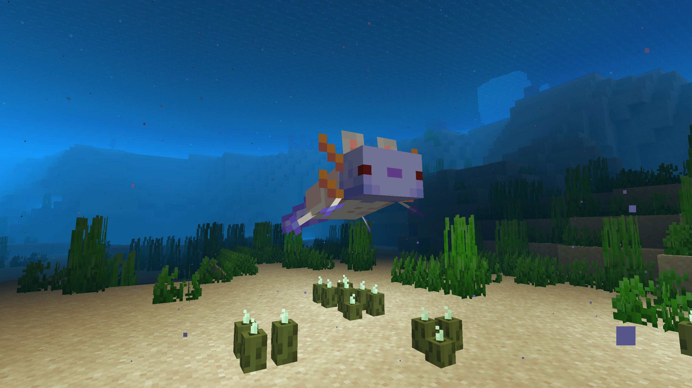

# AshAxolotl Axolotl Variant
### depends on [fabric](https://fabricmc.net/) and [mavapi](https://modrinth.com/mod/mavapi)

spawn using /summon minecraft:axolotl ~ ~ ~ {Variant:"ashaxolotl-axolotlvariant:ash"}
